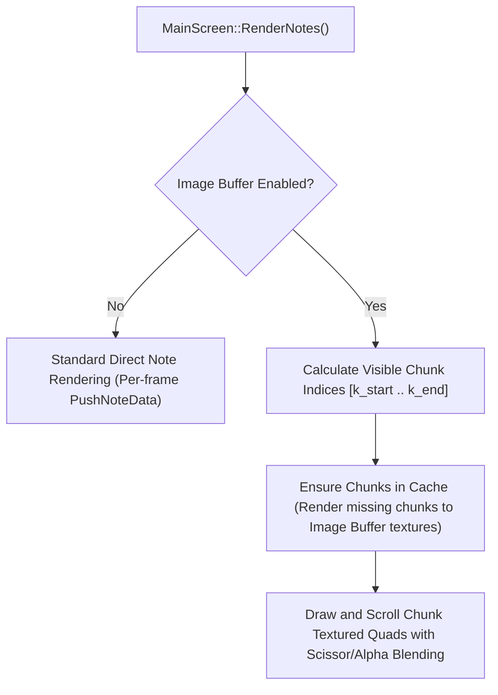

# Note Image Buffer Implementation Plan

## Problem & Background
In high note-density (Black MIDI) playback, submitting hundreds of thousands or millions of note vertex quads on every single frame places a heavy burden on GPU drawing and vertex dispatch. 

By implementing an **Image Buffer** for notes, the visualizer pre-renders discrete time **chunks** of notes once into offscreen image textures (chunk buffers). As playback progresses, the visualizer simply draws and scrolls these pre-rendered image texture quads across the screen at the exact sub-pixel offset corresponding to playback time. When new chunks scroll into the visible window, they are rendered into the image buffer cache and recycled as they scroll past. A user-controllable checkbox allows toggling this feature on or off at any time.

---

## Proposed Architecture



### 1. Chunk Partitioning & Coordinates
- Partition the song timeline into chunks of duration $T_\text{chunk} = \text{timespan}$ (matching the viewport note height $\text{notes\_cy}$).
- Each chunk $k$ corresponds to time slice $[k \cdot T_\text{chunk}, (k + 1) \cdot T_\text{chunk})$.
- Notes starting within chunk $k$ or sustaining into chunk $k$ from earlier times are rendered into Chunk Texture $k$ in chunk-relative coordinate space ($y = \text{chunk\_height} \cdot (1 - \text{pos} / T_\text{chunk})$).
- The image buffer maintains a cache pool of chunk textures (e.g. 4–8 chunk textures).

### 2. Scrolling & Screen Rendering
- At playback time $t_\text{start}$, chunk $k$ is drawn as a textured quad at:
  $$y_\text{bottom} = \text{notes\_y} + \text{notes\_cy} \cdot \left(1.0 - \frac{k \cdot T_\text{chunk} - t_\text{start}}{\text{timespan}}\right)$$
  $$y_\text{top} = y_\text{bottom} - \text{notes\_cy} \cdot \frac{T_\text{chunk}}{\text{timespan}}$$
- Quads smoothly translate downward each frame with exact subpixel accuracy as $t_\text{start}$ advances.
- Scissor clipping restricts rendering to $[\text{notes\_x}, \text{notes\_y}, \text{notes\_x} + \text{notes\_cx}, \text{notes\_y} + \text{notes\_cy}]$ so notes never spill over the keyboard or header.

### 3. Invalidation & Cache Management
- Cache invalidates whenever window resolution, track colors, zoom/geometry, or timespan change.
- Seeking and looping reuse matching cached chunks and evict LRU out-of-range chunks.

---

## Proposed Changes

### Configuration & Settings
#### [MODIFY] [Config.h](file:///c:/Users/tempu/Desktop/pianofromabove/PlayGroundFromAbove/PianoFromAbove/Config.h)
- Add `bool bImageBufferNotes;` to `VizSettings`.

#### [MODIFY] [Config.cpp](file:///c:/Users/tempu/Desktop/pianofromabove/PlayGroundFromAbove/PianoFromAbove/Config.cpp)
- Set `bImageBufferNotes = false;` default in `VizSettings::LoadDefaultValues()`.
- Load attribute `"ImageBufferNotes"` in `VizSettings::LoadConfigValues()`.
- Save attribute `"ImageBufferNotes"` in `VizSettings::SaveConfigValues()`.

---

### User Interface
#### [MODIFY] [RendererBase.cpp](file:///c:/Users/tempu/Desktop/pianofromabove/PlayGroundFromAbove/PianoFromAbove/RendererBase.cpp)
- Add `ImGui::Checkbox("Image Buffer Notes", &viz.bImageBufferNotes);` to the `RenderMode` menu.

---

### Shaders & Pipeline
#### [MODIFY] [note_vs.hlsl](file:///c:/Users/tempu/Desktop/pianofromabove/PlayGroundFromAbove/PianoFromAbove/note_vs.hlsl) & [dx11_note_vs.hlsl](file:///c:/Users/tempu/Desktop/pianofromabove/PlayGroundFromAbove/PianoFromAbove/dx11_note_vs.hlsl)
- Ensure note vertices output alpha = 1.0 (`float4(unpack_color(color), 1.0)`) so render-target chunk textures have transparent backgrounds and opaque note bodies/borders.

---

### Rendering Backends
#### [MODIFY] [Renderer.h](file:///c:/Users/tempu/Desktop/pianofromabove/PlayGroundFromAbove/PianoFromAbove/Renderer.h)
- Define `NoteChunk` structure, chunk texture pool, and virtual methods for chunk buffer management and rendering (`RenderNoteChunk`, `DrawNoteChunkQuad`, `ClearNoteChunkCache`).

#### [MODIFY] [Renderer.cpp](file:///c:/Users/tempu/Desktop/pianofromabove/PlayGroundFromAbove/PianoFromAbove/Renderer.cpp) & [RendererD3D11.cpp](file:///c:/Users/tempu/Desktop/pianofromabove/PlayGroundFromAbove/PianoFromAbove/RendererD3D11.cpp)
- Allocate chunk render targets / textures in D3D12 and D3D11 backends.
- Implement offscreen chunk note rendering into chunk textures.
- Implement quad drawing shader/pipeline with alpha blending to scroll chunk textures on screen.

---

### Game Logic & Note Dispatch
#### [MODIFY] [GameState.h](file:///c:/Users/tempu/Desktop/pianofromabove/PlayGroundFromAbove/PianoFromAbove/GameState.h) & [GameState.cpp](file:///c:/Users/tempu/Desktop/pianofromabove/PlayGroundFromAbove/PianoFromAbove/GameState.cpp)
- In `MainScreen::RenderNotes()`:
  - Check `VizSettings.bImageBufferNotes`.
  - When enabled: determine visible chunk indices, request required chunk renders for any cache misses, and render the scrolling chunk quads.
  - When disabled: execute standard direct note dispatch.

---

## Verification Plan

### Automated Build Verification
- Compile the solution using MSBuild (`x64 Debug` and `x64 Release`).
  ```powershell
  & 'C:\Program Files\Microsoft Visual Studio\2022\Community\MSBuild\Current\Bin\MSBuild.exe' PianoFromAbove.sln /p:Configuration=Debug /p:Platform=x64 -m
  ```

### Functional Verification
- Verify compilation succeeds with 0 errors.
- Verify that `Config.xml` / `PlayGroundFromAbove.xml` correctly persists the `ImageBufferNotes` state across restarts.
- Verify seamless visual parity and smooth scrolling with no visual tearing or gaps at chunk seams.
